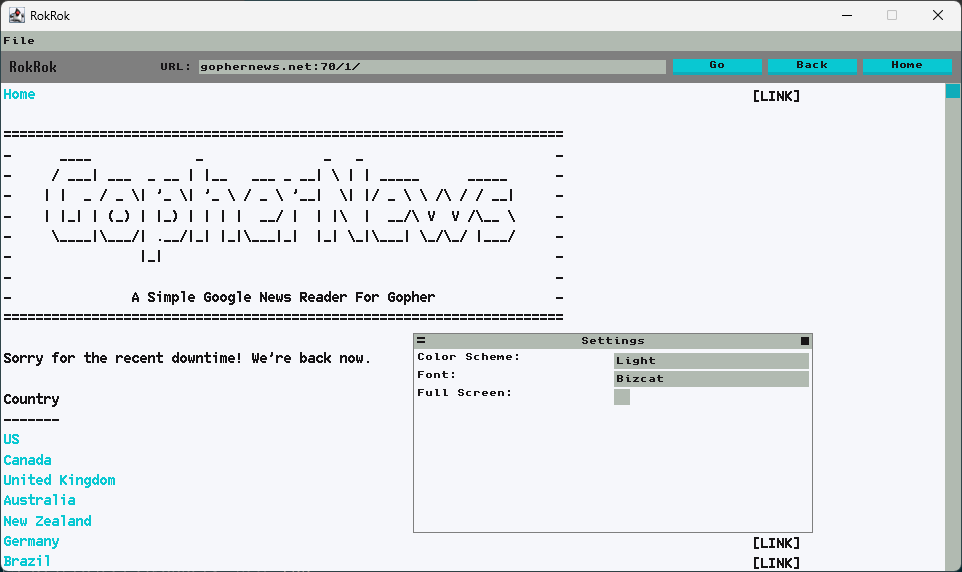

# RokRok

An experimental [Gopher](https://en.wikipedia.org/wiki/Gopher_(protocol)) browser written in Scala.

This is mostly a toy project to experiment with Scala Native's multi threading.

## Acknowledgments

Fonts:
 - [Unscii](http://viznut.fi/unscii/) by [Viznut](http://viznut.fi/)
 - [Bizcat](https://robey.lag.net/2020/02/09/bizcat-bitmap-font.html) by [Robey](https://robey.lag.net/)
