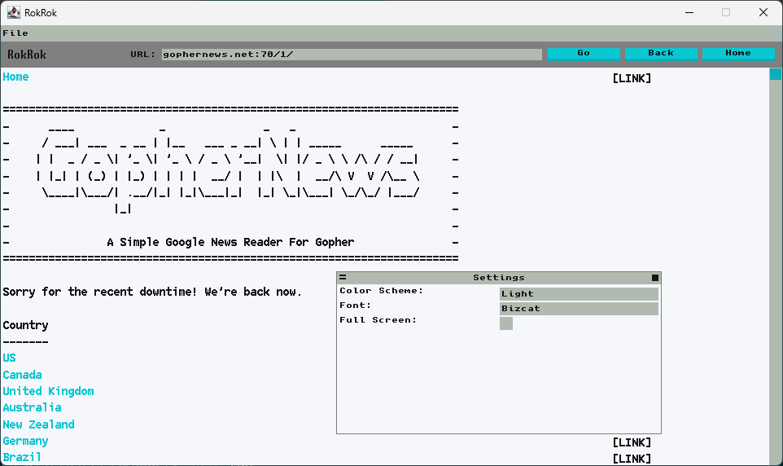

# RokRok

An experimental browser for alternative web protocols written in Scala.

Supports the following protocols:
- [HTTP](https://en.wikipedia.org/wiki/HTTP)
- [Gopher](https://en.wikipedia.org/wiki/Gopher_(protocol))
- [Spartan](https://github.com/michael-lazar/spartan)

And the following formats:
- Plain Text
- BMP images
- Gopher
- Gemtext (with Spartan extensions)

This is mostly a toy project to experiment with Scala Native's networking capabilities and [InterIm](https://github.com/JD557/interim/).

## Running

You can run the JVM version with `cs launch eu.joaocosta:rokrok_3:latest.release`

For the Native version, you can either download the [latest precompiled release](https://github.com/JD557/rokrok/releases) or build it source, which requires SDL2.
You can run it with `just run-native`.

## Acknowledgments

Fonts:
 - [Unscii](http://viznut.fi/unscii/) by [Viznut](http://viznut.fi/)
 - [Bizcat](https://robey.lag.net/2020/02/09/bizcat-bitmap-font.html) by [Robey](https://robey.lag.net/)
